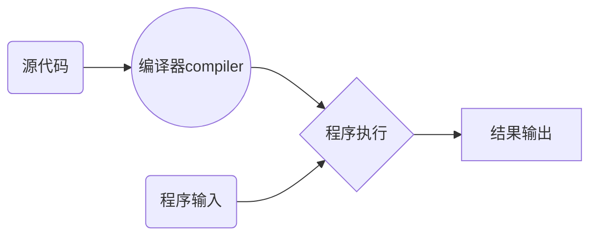
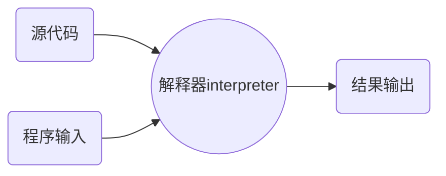

## 《Python语言程序设计》- 学习笔记

学习平台：

中国大学MOOC-《Python语言程序设计》

<https://www.icourse163.org/course/BIT-268001>

视频学习，授课老师：北京理工大学，嵩天（副教授）、黄天羽（副教授）、礼欣（讲师）

python123学习社区：

<https://python123.io/>


## 一、程序设计的基本方法

### 1、基本概念

#### 1.1 计算机

功能性、可编程性；

按照摩尔定律发展。


#### 1.2 程序设计语言

程序设计语言是一种用于交互的人造语言

简单、严谨、精确


C语言  1972年  第一个广泛应用的编程语言

python 1990年 最流行好用的编程语言之一


#### 1.3 编译与解释

##### 源代码

采用某种编程语言编写的计算机程序，人类可读。

##### 目标代码

计算机可直接执行，人类很难读懂。

##### 编译

将源代码一次性转换成目标代码的过程。




##### 解释

将源代码逐条转换成目标代码，同时逐条运行的过程。



#### 1.4 编程语言分两类

##### 静态语言

使用编译执行的编程语言。（编译过后即可不再需要源代码）

代表语言有：**c/c++、Java**


##### 脚本语言

使用解释执行的编程语言。（一直需要源代码参与）

代表语言有：**python、JavaScript、PHP**


> 两者本质上没有太大区别，优势各有不同：
>
> 静态语言：编译器一次性生成目标代码，优化更充分。
>
> 脚本语言：执行程序时需要源代码，维护更轻松，源代码在维护灵活，跨操作系统。


### 2、IPO

#### 2.1 概念

* I      input 输入，程序的输入

* P     Process处理，程序的主要逻辑

* O    output输出，程序的输出

  

#### 2.2 理解IPO

**程序的输入**

输入是一个程序的开始

有文件输入、网络输入、控制台输入、交互界面输入、内部参数输入等

**程序的输出**

输出是程序展示运算结果的方式

**处理**

处理是程序对输入数据进行计算产生输出结果的过程

处理方式统称为**算法**，它是程序最重要的部分

**算法是一个程序的灵魂！**


### 3、问题的计算部分

一个待解决问题中，可以使用程序辅助完成的部分

* 计算机只能解决计算问题，即问题的计算部分
* 一个问题可能有多个角度理解，产生不同的计算部分
* 问题的计算部分一般都有输入、处理和输出过程


### 4、编程解决问题的6个步骤

#### （1）分析问题

分析问题的计算部分，**想清楚**。


#### （2）划分边界
划分问题的功能边界，**规划IPO**。


#### （3）设计算法
设计问题的求解算法，**关注算法**。


#### （4）编写程序
编写问题的计算程序，**编程序**。


#### （5）调试测试
调试程序使正确运行，**运行调试**。


#### （6）升级维护
适应问题的升级维护，**更新完善**。


### 5、求解计算问题的精简步骤

#### （1）确定IPO：
明确计算部分及功能边界

#### （2）编写程序：
将计算求解的设计变成现实

#### （3）调试程序：
确保程序按照正确逻辑正确运行


### 6、计算机编程的价值

#### 6.1 能够训练思维

编程体现一种抽象交互关系，自动化执行思维模式

**计算思维**：区别于以数学为代表的**逻辑思维**和以物理为代表的**实证思维**的第三种思维模式

能够促进人类思考，增进观察力和深化对交互关系的理解

#### 6.2 能够增进认识

编程不单纯是求解计算问题

不仅要思考解决方法，还要思考用户体验、执行效率等

能够帮助程序员加深用户行为以及社会、文化认识

#### 6.3 能够带来乐趣

能够提供展示自身思想和能力的舞台

#### 6.4 能够提高效率

#### 6.5 能够带来就业机会


### 7、学习编程的误区

Q：编程难学吗？

A：掌握方法就很容易

**学习方法：**

首先，掌握编程语言的语法，熟悉基本概念和逻辑

其次，结合计算问题思考程序结构，会使用编程套路

最后，参照案例多练习多实践，学会举一反三。


## 二、Python语言概述与开发环境配置


### 1、python简介

百度百科：<https://baike.baidu.com/item/Python/407313?fr=aladdin>

-Python语言是一个由编程牛人领导设计并开发的编程语言
-Python语言是一 有开放、开源精神的编程语言
-Python语言应用于火星探测、搜索引擎、引力波分析等众多领域

-Python是一种解释型脚本语言，可以应用于以下领域： 

- Web 和 Internet开发
- 科学计算和统计
- 人工智能
- 教育
- 桌面界面开发
- 软件开发
- 后端开发


### 2、下载安装

官网：<https://www.python.org/>

安装教程： https://www.runoob.com/python3/python3-install.html 

安装时记得勾选  **Add Python 3.6 to PATH**。 


安装完成在开始菜单找到IDLE：

```hs
Python 3.8.0 (tags/v3.8.0:fa919fd, Oct 14 2019, 19:37:50) [MSC v.1916 64 bit (AMD64)] on win32
Type "help", "copyright", "credits" or "license()" for more information.
>>> print("hello world")
hello world
>>> 
```


## 三、python编程方式与案例

### 1、python的两种编程方式

#### 交互式

在IDLE中，通过输入每条语句即时运行结果，适合语法练习。

#### 文件式

在源文件中，批量执行一组语句并运行结果，编程的主要方式。


### 2、python代码初体验

**交互式**

```python
>>> r = 25 #变量r等于25
>>> area = 3.1415 * r * r #变量area
>>> print(area) # 打印
1963.4375000000002
>>> print("{:.2f}".format(area)) # 截取小数点后两位，四舍五入
1963.44
>>> 

# 单行注释

'''
多行注释
多行注释
'''
```


**文件式**

新建test.py文件，输入如下代码，按F5运行代码，画出一个五角星。

```python
from turtle import *
color('yellow','red')
begin_fill()
for i in range(5):
    fd(200)
    rt(144)
end_fill()
done()

```


### 3、实例1：温度转换

##### 3.1 需求分析

摄氏度与华氏度的相互转换

> 首先了解摄氏度与华氏度的概念：
>
> 摄氏度：以1标准大气压下水的结冰点为0度,沸点为100度,将温度进行等分刻画
>
> 华氏度：以1标准大气压下水的结冰点为32度,沸点为212度,将温度进行等分刻画


##### 3.2 问题分析

该问题**计算部分**的理解和确定：

理解1：直接将温度值进行转换

理解2：将温度信息发布的声音或图像形式进行理解和转换 （需要程序识别出语音或图像的温度值再进行转换）

理解3：使用程序来自动监控或爬取网上的温度信息发布渠道，并实时转换（需要网络、爬虫等信息相关）


分析结果：

本案例采用理解1，直接将温度值进行转换。


##### 3.3 划分边界

根据IPO的要求：

**输入**：带华氏或摄氏标志的温度值

**处理**：根据温度标志选择适当的温度转换算法

**输出**：带摄氏或华氏标志的温度值


##### 3.4 设计算法

输入输出格式设计：

标识放在温度后面，F表示华氏度，C表示摄氏度


根据华氏和摄氏温度定义，利用转换公式如下：

C =  (F - 32) / 1.8

F = C *  1.8 + 32

其中，C表示摄氏，F表示华氏。


##### 3.5 编程程序

编写并保存TempConvert.py文件

```python
# 摄氏度与华氏度的转换
TempStr = input("请输入带有符号的温度值：")
if TempStr[-1] in ['F','f']:
    C = (eval(TempStr[0:-1]) - 32)/1.8
    print("转换后的温度是{:.2f}C".format(C))
elif TempStr[-1] in ['C','c']:
    F = 1.8 * eval(TempStr[0:-1]) + 32
    print("转换后的温度是{:.2f}F".format(F))
else:
    print("输入格式错误")
```


学习中的**举一反三**：

试着理解代码，并尝试修改代码

```python
# 摄氏度与华氏度的转换  井号#为注释代码
TempStr = input("请输入带有符号的温度值：") # 定义变量TempStr，变量的值为用户的输入值，input是给用户提供输入
if TempStr[-1] in ['F','f']: # if判断条件:  如果 用户的输入值【截取最后一个字符】 是 'F'或'f' 执行冒号后面的表达式
    C = (eval(TempStr[0:-1]) - 32)/1.8 # 定义变量C  eval是把字符串解析成数字？ [0:-1] 是截取0到-1位，-1表示倒数1位
    print("转换后的温度是{:.2f}C".format(C)) # 打印 对C进行格式转换，取小数点后两位，四舍五入
elif TempStr[-1] in ['C','c']:# 如果if的条件不满足进入此elif判断， 如果 用户的输入值【截取最后一个字符】 是 'C'或'c' 执行冒号后面的表达式
    F = 1.8 * eval(TempStr[0:-1]) + 32
    print("转换后的温度是{:.2f}F".format(F)) # 打印
else: # 如果前面的条件都不满足则执行else内的表达式
    print("输入格式错误") # 打印字符串
```


计算问题的**扩展**：

根据已学习的温度转换，可以处理其他数据转换的问题，如：货币转换、长度转换、重量转换、面积转换...


## 四、python程序语法元素分析


