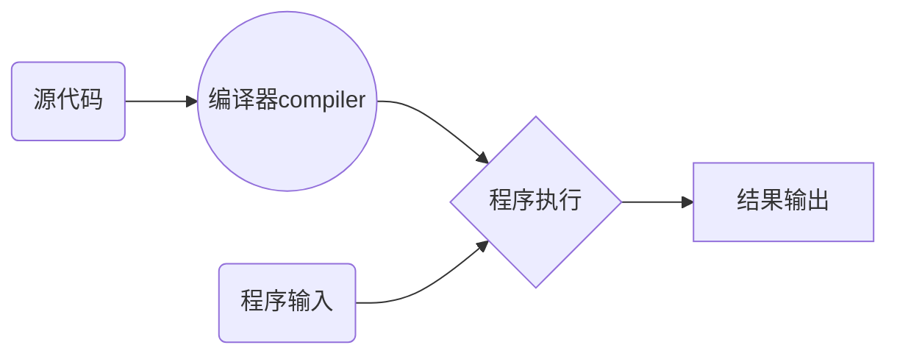
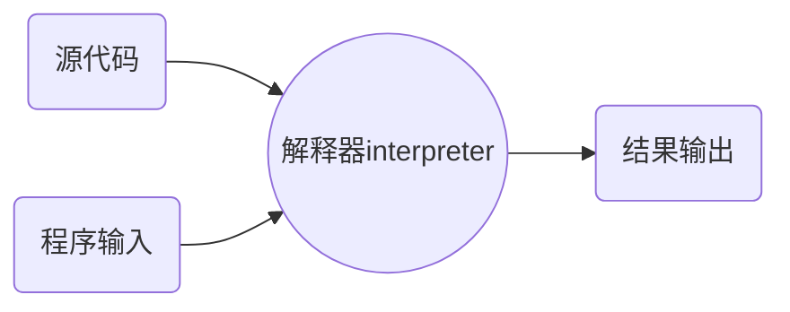
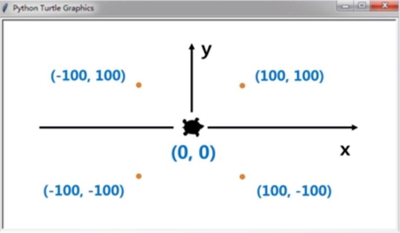
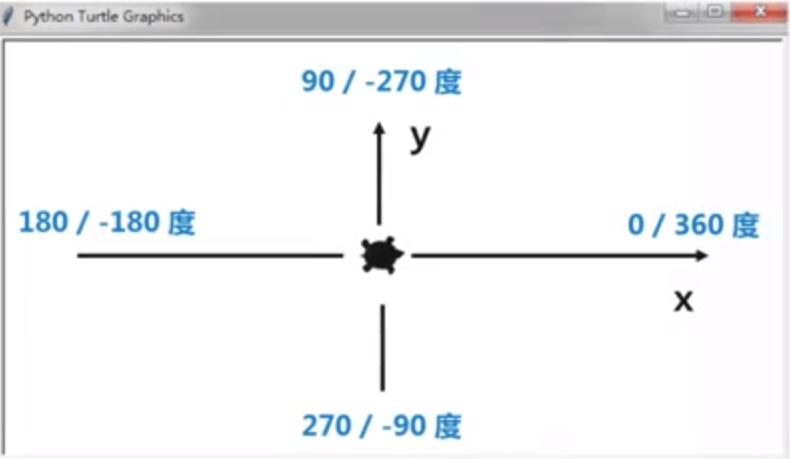

## 《Python语言程序设计》- 学习笔记

学习平台：

中国大学MOOC-《Python语言程序设计》

<https://www.icourse163.org/course/BIT-268001>

视频学习，授课老师：北京理工大学，嵩天（副教授）、黄天羽（副教授）、礼欣（讲师）

python123学习社区：

<https://python123.io/>


## 一、程序设计的基本方法

### 1、基本概念

#### 1.1 计算机

功能性、可编程性；

按照摩尔定律发展。


#### 1.2 程序设计语言

程序设计语言是一种用于交互的人造语言

简单、严谨、精确


C语言  1972年  第一个广泛应用的编程语言

python 1990年 最流行好用的编程语言之一


#### 1.3 编译与解释

##### 源代码

采用某种编程语言编写的计算机程序，人类可读。

##### 目标代码

计算机可直接执行，人类很难读懂。

##### 编译

将源代码一次性转换成目标代码的过程。




##### 解释

将源代码逐条转换成目标代码，同时逐条运行的过程。



#### 1.4 编程语言分两类

##### 静态语言

使用编译执行的编程语言。（编译过后即可不再需要源代码）

代表语言有：**c/c++、Java**


##### 脚本语言

使用解释执行的编程语言。（一直需要源代码参与）

代表语言有：**python、JavaScript、PHP**


> 两者本质上没有太大区别，优势各有不同：
>
> 静态语言：编译器一次性生成目标代码，优化更充分。
>
> 脚本语言：执行程序时需要源代码，维护更轻松，源代码在维护灵活，跨操作系统。


### 2、IPO

#### 2.1 概念

* I      input 输入，程序的输入

* P     Process处理，程序的主要逻辑

* O    output输出，程序的输出

  

#### 2.2 理解IPO

**程序的输入**

输入是一个程序的开始

有文件输入、网络输入、控制台输入、交互界面输入、内部参数输入等

**程序的输出**

输出是程序展示运算结果的方式

**处理**

处理是程序对输入数据进行计算产生输出结果的过程

处理方式统称为**算法**，它是程序最重要的部分

**算法是一个程序的灵魂！**


### 3、问题的计算部分

一个待解决问题中，可以使用程序辅助完成的部分

* 计算机只能解决计算问题，即问题的计算部分
* 一个问题可能有多个角度理解，产生不同的计算部分
* 问题的计算部分一般都有输入、处理和输出过程


### 4、编程解决问题的6个步骤

#### （1）分析问题

分析问题的计算部分，**想清楚**。


#### （2）划分边界
划分问题的功能边界，**规划IPO**。


#### （3）设计算法
设计问题的求解算法，**关注算法**。


#### （4）编写程序
编写问题的计算程序，**编程序**。


#### （5）调试测试
调试程序使正确运行，**运行调试**。


#### （6）升级维护
适应问题的升级维护，**更新完善**。


### 5、求解计算问题的精简步骤

#### （1）确定IPO：
明确计算部分及功能边界

#### （2）编写程序：
将计算求解的设计变成现实

#### （3）调试程序：
确保程序按照正确逻辑正确运行


### 6、计算机编程的价值

#### 6.1 能够训练思维

编程体现一种抽象交互关系，自动化执行思维模式

**计算思维**：区别于以数学为代表的**逻辑思维**和以物理为代表的**实证思维**的第三种思维模式

能够促进人类思考，增进观察力和深化对交互关系的理解

#### 6.2 能够增进认识

编程不单纯是求解计算问题

不仅要思考解决方法，还要思考用户体验、执行效率等

能够帮助程序员加深用户行为以及社会、文化认识

#### 6.3 能够带来乐趣

能够提供展示自身思想和能力的舞台

#### 6.4 能够提高效率

#### 6.5 能够带来就业机会


### 7、学习编程的误区

Q：编程难学吗？

A：掌握方法就很容易

**学习方法：**

首先，掌握编程语言的语法，熟悉基本概念和逻辑

其次，结合计算问题思考程序结构，会使用编程套路

最后，参照案例多练习多实践，学会举一反三。


## 二、Python语言概述与开发环境配置


### 1、python简介

百度百科：<https://baike.baidu.com/item/Python/407313?fr=aladdin>

-Python语言是一个由编程牛人领导设计并开发的编程语言
-Python语言是一 有开放、开源精神的编程语言
-Python语言应用于火星探测、搜索引擎、引力波分析等众多领域

-Python是一种解释型脚本语言，可以应用于以下领域： 

- Web 和 Internet开发
- 科学计算和统计
- 人工智能
- 教育
- 桌面界面开发
- 软件开发
- 后端开发


### 2、下载安装

官网：<https://www.python.org/>

安装教程： https://www.runoob.com/python3/python3-install.html 

安装时记得勾选  **Add Python 3.6 to PATH**。 


安装完成在开始菜单找到IDLE：

```hs
Python 3.8.0 (tags/v3.8.0:fa919fd, Oct 14 2019, 19:37:50) [MSC v.1916 64 bit (AMD64)] on win32
Type "help", "copyright", "credits" or "license()" for more information.
>>> print("hello world")
hello world
>>> 
```


## 三、python编程方式与案例

### 1、python的两种编程方式

#### 交互式

在IDLE中，通过输入每条语句即时运行结果，适合语法练习。

#### 文件式

在源文件中，批量执行一组语句并运行结果，编程的主要方式。


### 2、python代码初体验

**交互式**

```python
>>> r = 25 #变量r等于25
>>> area = 3.1415 * r * r #变量area
>>> print(area) # 打印
1963.4375000000002
>>> print("{:.2f}".format(area)) # 截取小数点后两位，四舍五入
1963.44
>>> 

# 单行注释

'''
多行注释
多行注释
'''
```


**文件式**

新建test.py文件，输入如下代码，按F5运行代码，画出一个五角星。

```python
from turtle import *
color('yellow','red')
begin_fill()
for i in range(5):
    fd(200)
    rt(144)
end_fill()
done()

```


### 3、实例1：温度转换

##### 3.1 需求分析

摄氏度与华氏度的相互转换

> 首先了解摄氏度与华氏度的概念：
>
> 摄氏度：以1标准大气压下水的结冰点为0度,沸点为100度,将温度进行等分刻画
>
> 华氏度：以1标准大气压下水的结冰点为32度,沸点为212度,将温度进行等分刻画


##### 3.2 问题分析

该问题**计算部分**的理解和确定：

理解1：直接将温度值进行转换

理解2：将温度信息发布的声音或图像形式进行理解和转换 （需要程序识别出语音或图像的温度值再进行转换）

理解3：使用程序来自动监控或爬取网上的温度信息发布渠道，并实时转换（需要网络、爬虫等信息相关）


分析结果：

本案例采用理解1，直接将温度值进行转换。


##### 3.3 划分边界

根据IPO的要求：

**输入**：带华氏或摄氏标志的温度值

**处理**：根据温度标志选择适当的温度转换算法

**输出**：带摄氏或华氏标志的温度值


##### 3.4 设计算法

输入输出格式设计：

标识放在温度后面，F表示华氏度，C表示摄氏度


根据华氏和摄氏温度定义，利用转换公式如下：

C =  (F - 32) / 1.8

F = C *  1.8 + 32

其中，C表示摄氏，F表示华氏。


##### 3.5 编程程序

编写并保存TempConvert.py文件

```python
# 摄氏度与华氏度的转换
TempStr = input("请输入带有符号的温度值：")
if TempStr[-1] in ['F','f']:
    C = (eval(TempStr[0:-1]) - 32)/1.8
    print("转换后的温度是{:.2f}C".format(C))
elif TempStr[-1] in ['C','c']:
    F = 1.8 * eval(TempStr[0:-1]) + 32
    print("转换后的温度是{:.2f}F".format(F))
else:
    print("输入格式错误")
```


学习中的**举一反三**：

试着理解代码，并尝试修改代码

```python
# 摄氏度与华氏度的转换  井号#为注释代码
TempStr = input("请输入带有符号的温度值：") # 定义变量TempStr，变量的值为用户的输入值，input是给用户提供输入
if TempStr[-1] in ['F','f']: # if判断条件:  如果 用户的输入值【截取最后一个字符】 是 'F'或'f' 执行冒号后面的代码块
    C = (eval(TempStr[0:-1]) - 32)/1.8 # 定义变量C  eval是把字符串解析成数字？ [0:-1] 是截取0到-1位，-1表示倒数1位
    print("转换后的温度是{:.2f}C".format(C)) # 打印 对C进行格式转换，取小数点后两位，四舍五入
elif TempStr[-1] in ['C','c']:# 如果if的条件不满足进入此elif判断， 如果 用户的输入值【截取最后一个字符】 是 'C'或'c' 执行冒号后面的代码块
    F = 1.8 * eval(TempStr[0:-1]) + 32
    print("转换后的温度是{:.2f}F".format(F)) # 打印
else: # 如果前面的条件都不满足则执行else内的代码块
    print("输入格式错误") # 打印字符串
```


计算问题的**扩展**：

根据已学习的温度转换，可以处理其他数据转换的问题，如：货币转换、长度转换、重量转换、面积转换...


## 四、python程序语法元素分析

### 1、程序的格式框架

**代码高亮**：编程的色彩辅助系统，每个编辑器的色彩可能会不一样。

**缩进**：一行代码前的空白区域，表达程序的格式框架。

	* **严格明确**：缩进是语法的一部分，**缩进不正确程序运行错误**。
	* **所属关系**：表达代码间包含和层次关系的唯一手段。
	* **长度一致**：程序内一致即可，一般用4个空格或者1个Tab

**注释**：用于提高代码可读性的辅助性文字，不被执行。

* **单行注释**：以`#`井号开头，其后为注释内容。
* **多行注释**：以`'''`三个单引号开头和结尾。


### 2、命名和保留字

**变量**：程序中用于保存和表示数据的占位符号。

**命名**：关联变量标识符的过程叫命名。

* **命名规则**：大小写字母、数字、下划线和汉字等字符及组合。
* **注意事项**：大小写敏感、首字母不能是数字、不与保留字相同。


#### 保留字

被编程语言内部定义并保留使用的标识符。

* **python语言有33个保留字（也叫关键字）**
* 保留字是编程语言的基本单词，大小写敏感

| and      | elif    | import | `raise` | global     |
| -------- | ------- | ------ | ------- | ---------- |
| as       | else    | in     | return  | `nonlocal` |
| `assert` | except  | `is`   | try     | True       |
| break    | finally | lambda | while   | False      |
| `class`  | for     | not    | `with`  | None       |
| continue | from    | or     | `yield` |            |
| def      | if      | pass   | del     |            |

**注意**：True、False、None首字母必须大写，否则就是变量。assert、class、is、raise、with、yield、nonlocal 除这7个关键字之外的其他关键字是基础语法中出现的，即本次课程中使用到的。

**说明**：

- False，True ：布尔值
- None :  表示空值，有自己的数据类型NoneType
- and，or，not：逻辑与、或、非
- as ：给引入的模块取新的名字
- assert ：声明某个表达式必须为真，编程中若该表达式为假就会报错AssertionError
- break，continue，pass：控制语句和占位词
- if，else，elif，for，while：结构语句
- class：用来定义类
- def，return： 用来定义函数，从函数返回
- del：删除列表中不需要的对象，删除定义过的对象
- try，except，finally：try结构
- from，import：从模块中导入函数，调用时可省略模块名
- lambda：匿名函数
- in：判断对象是否在列表中
- is：判断两个变量是否指向同一对象
- global：定义全局变量，即便实在函数体内定义的global变量也全局可用
- nonlocal： 用来在函数或其他作用域中使用外层(非全局)变量 
- with： 用来处理异常 
- raise： 触发异常后，后面的代码就不会再执行 
- yield：生成器用


### 3、数据类型

程序设计语言不允许存在语法歧义，需要定义数据的形式，通过一定方式向计算机表达数据的形式叫数据类型。

如："123"是字符串，123是数字


数据类型：字符串、整数、浮点数、列表（数组？）


#### 字符串

单引号或双引号包括的有序字符；有序指有索引值。

* python中字符串的序号有 **正向递增序号** 和 **反向递减序号**

```python
'''
-5 -4 -3 -2 -1
 '我是字符串'
 0 1 2 3 4
'''
# 反向递减 即表示倒数第几个，最后一个为倒数第一个，即-1
```

* **获取单个字符**：使用[]方括号获取字符串中单个字符

  ```python
  #  获取单个字符串的格式：<字符串>[索引]
  # '我是字符串'[0] 返回'我'
  # '我是字符串'[-1],返回'串'
  ```

* **切片**：返回字符串中一段子串

  ```python
  #  获取子串的格式：<字符串>[M:N]
  # '我是字符串'[1:3] 返回'是字'，从1到3前，不包括3。
  # '我是字符串'[0：-1],返回'我是字符'，从0到倒数第一个前，不包括倒数第一个。
  ```

  

#### 数字

包含整数和浮点数

* 整数：数字中的整数，包含正整数和负整数。
* **浮点数**：数学中的实数，带有小数部分，包含正负数。


#### 列表

由0个或多个数据组成的有序序列。

```python
['F','C']
```

**使用关键字 in 判断一个元素是否在列表中**

```python
'c' in ['C','c'] # 返回布尔值 True，如果前者不在列表中返回False
```


### 4、语句与函数

#### 赋值语句

由赋值符号‘=’构成的一行代码


#### 分支语句（if elif else）

由判断条件决定程序运行方向的语句

```python
if Ture: # 注意在条件判断后有冒号
    print('打印1') # 注意在条件判断内部代码块有代码缩进
else：# 有冒号
	print('打印2')
```


#### 函数

根据输入参数产生不同输出的功能过程

```python
# 函数格式： <函数名> (<参数>)
# 这些都是函数
input()
eval()
print()
```


### 5、python程序的部分函数


#### python程序的输入和输出

通过input()和print()输入和输出


#### input() 输入函数

从控制台获得用户输入内容的函数

```python
#格式：<变量> = input(<提示信息字符串>)
TempStr = input('请输入内容：') #使用input函数在控制台提示用户输入内容，并获得用户输入的内容赋值给变量

#注意：输入的内容为字符串格式返回给变量
```


#### print() 输出函数

以字符形式向控制台输出结果的函数

```python
#格式：print(<输出字符串或字符串变量>)
```


#### format() 格式化

print()函数的**格式化**：

```python
print("转换后的温度是{:.2f}".format(C))

# 字符串内部的{}表示槽，后续变量填充到槽中
# {:.2f}表示将变量C填充到这个位置时取小数点后2位
```


#### eval() 评估函数

去掉参数最外侧引号并执行余下语句的函数，简单叫评估函数。

```python
#格式： eval(<字符串或字符串变量>)

>>> eval('1') # 数字字符串去掉引号变成数字
1
>>> eval('1+2') # 去掉引号后是语句1+2 执行它得到3
3
>>> eval('"1+2"') # 去掉引号是字符串"1+2"
"1+2"
>>> eval('print("Hello")') # 去掉引号后是语句print("Hello")，执行它打印Hello
Hello
```


## 五、深入理解Python语言


### 1、计算机技术的演进过程

**1946-1981 计算机系统结构时代（35年）** 解决计算能力问题

1946年 第一台计算机诞生

科学家们研制不同的计算机和计算机体系结构

1981年 第一台IBM PC机诞生

 

**1981年-2008年 网络和视窗时代（27年）** 解决交互问题，人与计算机交互通过视窗操作，计算机与计算机交互通过网络实现

2008年 安卓操作系统诞生，由pc时代向移动时代转换

互联网、windows视窗操作系统


**2008年-2016年 复杂信息系统时代（8年）** 解决数据问题

云计算、大数据、网络安全、等等

2016年 计算机首次打败了国际围棋世界冠军


**2016年开始-   人工智能时代**   解决人类问题，用计算机帮助人类解决问题


**目前的时代**：

在真正度过到人工智能时代之间会有一个短暂的**新计算时代**，关心计算、关心交互、关心数据、关心人工智能。


### 2、编程语言的多样初心

#### 2.1 编程语言有哪些？

Basic，C，C++，C#,CSS,HTML，Java，JavaScript，Lisp，Object C, Perl,PHP,Python,SQL,VBA,VB.Net.......

600多种编程语言，编程语言就是一个江湖。


#### 2.2 不同编程语言的初心和适用对象

##### C语言

诞生在计算机系统结构时代，用于写操作系统的语言。

做计算机底层程序的设计和开发。

* 学习内容：指针、内存、数据类型

* 语言本质：理解计算机系统结构

* 解决问题：性能

* 适用对象：计算机类专业


##### Java语言

诞生于网络和视窗时代，当时计算机希望与其他计算机交互，Java提出了采用面向对象的方式，通过跨平台的方法来解决跨平台问题。

* 学习内容：对象、跨平台、运行时

* 语言本质：理解主客体关系

* 解决问题：跨平台

* 适用对象：软件类专业


##### C++语言

C语言的演进，又拥有面向对象的特点

* 学习内容：对象、多态、继承

* 语言本质：理解主客体关系

* 解决问题：大规模程序（比如操作系统、大规模图形处理程序等）

* 适用对象：计算机类专业


##### VB和VB衍生的.NET

诞生于网络视窗时代，通过写VB程序可以实现小的桌面窗口应用

* 学习内容：对象、按钮、文本框

* 语言本质：理解交互逻辑（人机交互）

* 解决问题：桌面应用

* 适用对象：不确定（目前的应用更需要同时可以在桌面运行，也可以在移动端运行，因此VB的适用对象很少了）


##### python语言

发展于复杂信息系统时代

* 学习内容：编程逻辑。第三方库

* 语言本质：理解问题求解

* 解决问题：各类问题（各类问题的计算部分的实现）

* 适用对象：所有专业


#### 2.3 2018年以后的计算环境

计算机性能不再是解决一般问题的瓶颈

移动互联网的广泛普及

大数据、云计算、物联网、信息安全、人工智能等需求爆发，这些领域的发展带来很多的计算需求。

解决日益增长的计算需求，用什么语言？


### 3、python语言

#### 特性

python是通用语言

python是脚本语言

python是开源语言

python是跨平台语言

python是多模型语言

...

只需要记住一点：**python语言是通用语言**。


##### 通用语言

可以用于普适的计算问题求解的开发，图形运算、文件处理、发现引力波等等问题，并不局限于某一个门类的应用，通用性是最大的特点。


#### 优势

* 语法有强制可读性

* 较少的底层语法元素

* 多种编程方式

* 支持中文字符


语法简洁，完成同样功能代码量不到C代码量的10%。

提高10倍编程产出。

目前已有13万第三方库，而且正在快速增长，平均每年已2万的规模增长

* 快速增长的计算生态

* 避免重复造轮子

* 开放共享

* 跨操作系统平台


结合生态的高产，可以把编程产出再提高10倍。


#### 如何看待Python语言？

有句话：人生苦短，我学python。

* C/C++: python归python，C归C。python能做python语言能做的事，但是涉及到计算机系统底层，涉及到计算机内存，涉及到计算机接口方面的工作，还是由C语言来完成。由C语言完成的代码，可以经过封装成python的接口，以第三方库的形式或者以语句的形式来调用C语言编写的代码。

不需要与计算机系统底层打交道的或对效率执行速度没有更高要求的程序，完全可以通过python来完成，进而程序的编写变得非常的快速和高效。

* Java：Java针对特定的开发和岗位需求，比如安卓手机端的原生应用的开发，包括某些网络应用的后台中间件的开发等。

* HTML/CSS/JS: 不可替代的前端技术，全栈能力

* 其他语言：R/GO/Matlab等，特定领域。


python是最高产的程序设计语言以及：

* 掌握抽象并求解计算问题综合能力的语言

* 了解产业界解决复杂计算问题方法的语言

* 享受利用编程将创新变为现实乐趣的语言


工具决定思维：关注工具变革的力量。


### 4、“超级语言”的诞生


#### 4.1 编程语言的种类

##### 机器语言

* 一种二进制语言，直接使用二进制代码表达指令

* 计算机硬件（CPU）可以直接执行，与具体CPU型号有关

> 完成2+3功能的机器语言：
>
> 11010010  00111011


##### 汇编语言

* 一种将二进制代码直接对应助记符的编程语言

* 汇编语言与CPU型号有关，程序不通用，需要汇编器转换

> 完成2+3的汇编语言：
>
> add 2,3,result   （典型的CPU指令格式）
>
> 表示第一个参数2与第二个参数3相加，存到result


##### 高级语言

可见，机器语言和汇编语言并不适合用于编程，更适合用于计算机底层硬件的设计跟开发。因此就有了高级语言：

* 更接近自然语言，同时更容易描述计算问题。

* 高级语言代码与具体CPU型号无关，便于后执行。

> 完成2+3功能的高级语言：
>
> result = 2 + 3


#### 4.2 编程语言种类的发展

总结编程语言的种类：

* 机器语言：代码直接执行，与CPU型号有关

* 汇编语言：有助记符，汇编器，与CPU型号有关

* 高级语言：接近自然语言，编译器，与CPU型号无关


还有一种类型：

##### 超级语言

* 具有庞大计算生态，可以很容易利用已有代码功能

* 编程思维不再是刀耕火种，而是集成开发

> 完成2+3功能的超级语言：
>
> result = sum(2, 3)   
>
> 利用已有的函数模块得到自己想要的结果。

 

**python语言是目前唯一的超级语言，前进的步伐不可阻挡。**


## 六、python蟒蛇绘制


### 1、“python蟒蛇绘制” 问题分析

用程序绘制一条蟒蛇：

* 貌似很有趣，可以来试试

* 先学会蟒蛇绘制，再绘一朵玫瑰花送给TA。


设计蟒蛇的基本形状：

就像一条贪吃蛇....【无图】


问题1：计算机绘图是什么原理？

一段程序为何能够产生窗体，为何能在窗体上绘制图形？

问题2：python蟒蛇绘制从哪里开始呢？

如何绘制一条线？如何绘制一个弧形？如何绘制一个蟒蛇？


代码如下：

```python
# 画一条蟒蛇
import turtle # 导入绘图模块：海龟
turtle.setup(650, 350, 500, 200) # 设置窗口大小（宽，高，？，？）
turtle.penup() # 抬笔
turtle.fd(-250) # 设置落笔位置？
turtle.pendown() # 落笔
turtle.pensize(25) # 笔的大小
turtle.pencolor("red") # 笔的颜色
turtle.seth(-40) # 设置幅度？
for i in range(4):
  turtle.circle(40, 80)
  turtle.circle(-40, 80)
turtle.circle(40, 80/2)
turtle.fd(40)
turtle.circle(16, 180)
turtle.fd(40 * 2/3)
turtle.done() # 完成
```


### 2、turtle库的使用

#### 2.1 turtle库概述

turtle（海龟）库是turtle绘图体系的python实现

* turtle绘图体系：1969年诞生，主要用于程序设计入门的一种绘图方式。

* 是python语言的**标准库**之一。

* 入门级的图形绘制函数库。


#### 2.2 标准库与第三方库

python计算生态 = 标准库 + 第三方库

* 标准库：随解释器直接安装到操作系统中的功能模块。

* 第三方库：需要经过安装才能使用的功能模块
* 库Library、包Package、模块Module，统称**模块**


#### 2.3 turtle库的原理

turtle（海龟）是一种真实的存在

* 有一只海龟，其实在窗体正中心，在画布上游走
* 它走过的轨迹就形成了绘制的图形
* 海龟由程序控制，可以变换颜色、改变宽度等


##### turtle.setup() 窗体设置

```python
turtle.setup(winth，height，statrX，startY)
# 设置窗口大小和启动位置坐标
# 后两个参数可选（不设置时，窗体在屏幕正中心）
# 启动坐标是窗体左上角相对于电脑屏幕左上角的坐标
# 此函数非必须
```


#### 2.4 turtle坐标体系

包含绝对坐标和海龟坐标两种


##### 绝对坐标

相对于画布正中心的坐标。

最开始“海龟”(画笔) 在画布（窗体）正中心，坐标是(0, 0)，向右是x轴，向上是y轴。



###### turtle.goto(x, y)  去到该坐标

```python
turtle.goto(x, y)  # 让海龟去到该坐标
```


##### 海龟坐标

相对于‘海龟’ 当下位置的坐标，有前进方向、后退方向、左侧方向、右侧方向。


###### turtle.fd(d) 表示向前方向

* d 行进距离，单位px

###### turtle.bk(d) 表示向后方向

* d 行进距离，单位px

###### turtle.circle() 表示以海龟左侧的某一点为圆心绘制曲线


##### 角度坐标体系




**逆时针角度值为正数，顺时针角度值为负数！**

x轴 表示 0 或 360度

-x轴 表示 180 或 -180 度

y轴 表示 90 或 -270度

-y轴 表示 270 或 -90 度


###### turtle.seth(angle) 按照角度改变海龟行进方向

* 不在画布绘制任何信息，只是改变行进方向
* angle 绝对角度

###### turtle.left(angle) 向左方向行进

###### turtle.right(angle) 向右方向行进


##### 练习：画“Z”字

```python
# 海龟画Z
import turtle # 导入海龟绘图
# 海龟初始位置于画布正中心，x轴方向为前方
turtle.left(45) # 海龟向左45度
turtle.fd(150) # 前进150像素
turtle.right(135) # 向右135度
turtle.fd(300)
turtle.left(135)
turtle.fd(150)
```


#### 2.5 RGB色彩体系

##### RGB色彩模式

* RGB指红、绿、蓝 三个通道的颜色组合
* 覆盖视力所能感知的所有颜色
* 每个通道的取值范围0-255整数 或 0-1 的小数


##### 常用RGB色彩

| 英文名称 | RGB整数值     | RGB小数值        | 中文名称 |
| -------- | ------------- | ---------------- | -------- |
| while    | 255,255,255   | 1,1,1            | 白色     |
| yellow   | 255,255,0     | 1,1,0            | 黄色     |
| magenta  | 255,0,255     | 1,0,1            | 洋红     |
| cyan     | 0,255,255     | 0,1,1            | 青色     |
| blue     | 0,0,255       | 0,0,1            | 蓝色     |
| black    | 0,0,0         | 0,0,0            | 黑色     |
| seashell | 255, 245, 238 | 1, 0.96, 0.93    | 海贝色   |
| gold     | 255, 215, 0   | 1, 0.84, 0       | 金色     |
| pink     | 255, 192, 203 | 1, 0.75, 0.80    | 粉红色   |
| brown    | 165, 42, 42   | 0.65, 0.16, 0.16 | 棕色     |
| purple   | 160, 32, 240  | 0.63, 0.13, 0.94 | 紫色     |
| tomato   | 255, 99, 71   | 1, 0.39, 0.28    | 番茄色   |


##### turtle默认使用小数值

* 默认采用小数值 可切换为整数值

##### turtle.colormode(mode)切换取值模式

* mode模式，1表示小数模式，255表示整数模式


### 3、turtle程序语法元素分析

#### 3.1 库引用与import

##### （1）库引用 import

扩充python程序功能的方式叫库引用。

使用`import`关键字来完成库引用，采用`<a>.<b>()`编码风格

```python
# 语法：
import <库名>
<库名>.<函数名>(<函数参数>)
```


##### （2）使用 from 和 import

使用`from`和`import`关键字共同完成

```python
# 语法：
from <库名> import <函数名>     # 单独导入库中的某个函数
或
from <库名> import *   # 导入库中的全部函数
<函数名1>(<函数参数>)
<函数名2>(<函数参数>)
```

可以理解为**把库中的函数，导入到当前程序**，因此在当前程序可以直接使用库中才有的函数。


##### （3）使用import和as

```python
# 语法：
import <库名> as <库别名>
<库别名>.<函数名>(<函数参数>)
```

给库起个小名。

* 给调用的外部库关联一个更短、更适合自己的名，对编写程序带来便利。


##### （4）三种import用法的比较

第一种方式：

```python
import <库名>
<库名>.<函数名>(<函数参数>)
```

<库名>.<函数名> 意思是 库（新程序）中的函数，如库是turtle，即turtle中的函数。
**使用此方式就不会出现函数重名的问题**


第二种方式：

```python
from <库名> import <函数名>
或
from <库名> import *
<函数名1>(<函数参数>)
<函数名2>(<函数参数>)
```

**使用这种方式有可能导致库中的函数与当前程序自定义的函数重名，那么就会发生冲突**


第三种方式：

```python
# 语法：
import <库名> as <库别名>
<库别名>.<函数名>(<函数参数>)
```

**使用这种方式不用担心函数重名问题，也可以减少代码量。**


**如果程序很小，只使用一个库，没有自己定义的函数，可以使用第二种方式。否则，为了避免函数重名，又能减少代码量推荐使用第三种方式。**


#### 3.2 turtle画笔控制函数


##### turtle.penup() 别名 turtle.pu()

抬起画笔，海龟（画笔）在飞行，此时运行画笔将不形成轨迹。


##### turtle.pendown() 别名 turtle.pd()

落下画笔，海龟（画笔）在爬行，此时行进画笔将形成轨迹。


##### turtle.pensize(width) 别名 turtle.width(width)

画笔大小（宽度）


##### turtle.pencolor(color)

画笔颜色，字符串颜色名或rgb值

* 颜色字符串：turtle.pencolor('purple')
* RGB小数值：turtle.pencolor(0.63, 0.13, 0.94)
* RGB元祖值：turtle.pencolor((0.63, 0.13, 0.94))


#### 3.3 turtle运动控制函数

控制画笔的行进：走直线&走曲线


##### turtle.forward(d) 别名 turtle.fd(d)

向前行进，走直线。

d：表示行进距离，单位像素，可以是负数。


##### turtle.circle(r, extent=Node)

根据半径r，绘制extent角度的弧形

r：默认圆心在海龟左侧r距离的位置

extent：绘制角度，默认是360度整圆

```python
turtle.circle(100) # 以左侧距离100像素为圆心，画360整圆
turtle.circle(-100) # 以右侧距离100像素为圆心，画360整圆
```


#### 3.4 turtle方向控制函数

控制海龟面对的方向：绝对角度&海龟角度


##### turtle.setheading(angle) 别名 turtle.seth(angle)

改变行进方向，海龟的角度

angle： 绝对角度值，逆时针正数，顺时针负数。

```python
turtle.seth(45) # x轴向上的45°
turtle.seth(-135) # x轴的向下135°，即x轴顺时针走135°
```


##### turtle.left(angle) 

海龟向左转

angle: 海龟当前方向上旋转的角度（相对角度）


##### turtle.right(angle)

海龟向右转

angle: 海龟当前方向上旋转的角度（相对角度）


**注意：方向控制函数只改变海龟的方向，并不会形成轨迹。**


### 4、循环语句和range()函数


##### 循环语句

按照一定次数循环执行的一组语句，**使用for和in关键字来实现**

```python
# 语法
for <变量> in range(<参数>):
    <被循环执行的语句>
    
# <变量>：表示每次循环的计数，0 到 <次数>-1
# <参数>：循环的次数

#例:
for i in range(5):
    print(i)

# 打印：0 1 2 3 4
```


##### range()函数

产生循环计数序列

* range(N)

  产生0 到 N-1 的整数序列，共N个。

  ```python
  range(5)
  # 0,1,2,3,4
  ```

* range(M, N)

  产生M到N-1的整数序列，共N-M个。

  ```python
  range(2, 5)
  # 2,3,4
  ```

  


## 七、数字类型及操作

### 1、整数

#### 1.1 概念

与数学中整数的概念一致

* 可正可负，没有范围限制
* pow(x, y)函数：计算x的y次方


#### 1.2 pow(x, y)函数：计算x的y次方

```python
>>> pow(2,3)
8
```


#### 1.3 整数类型

4种进制表示形式

* 十进制：1  ， 2  ，100， -120
* 二进制：以0b或0B开头，0b010、-0B101
* 八进制：以0o或0O开头，0o123、-0O456
* 十六进制：以0x或0X开头，0x9a、-0X89


### 2、浮点数

#### 2.1 概念

与数学中实数的概念一致

* 带有小数点及小数的数字
* 浮点数取值范围和小数精度都存在限制，但常规计算可忽略
* 取值范围数量级约-10的308次方 和 10的308次方，精度数量级10的-16次方


#### 2.2 浮点数运算的问题

浮点数间运算存在**不确定尾数**，不是bug

```python
>>> 0.1+0.2
0.30000000000000004 #不确定尾数
>>> 0.1+0.3
0.4
>>> 0.1+0.2 == 0.3
False
>>> round(0.1+0.2, 1) == 0.3 # 使用round()四舍五入函数解决 不确定尾数的问题
True
>>> 
```


#### 2.3 造成不确定尾数的原因

不仅在python有这个问题，其他语言也会有同样的问题，这涉及到计算机内部运算的原理

计算机中如何表示0.1？

53位二进制表示小数部分，约10的-16次方

0.00101010101010101001011110101010101010101010101010110101010（二进制小数）

计算机中二进制和十进制不存在严格的对等关系，0.1在用二进制表示的时候，它是一个无限的小数，计算机只能解决53位，尽量的接近0.1，但它并不是真正的等于0.1。

转成十进制后会有一个尾数：

0.10000000000000000546567234687236487236478236482109820349820（十进制表示）

在计算机中输出的时候，只输出了16位小数。


**二进制表示小数，可以无限接近，但不完全相等。**


#### 2.4 round(x, d) 四舍五入

对x四舍五入，d是小数截取小数

* 浮点数间运算及比较时用round()函数辅助
* 不确定尾数一般发生在10的-16次方左右（即小数点后16位左右），round()十分有效


#### 2.5 浮点数可以用科学计数法表示

使用e或E作为幂的符号，以10为基数，格式如下：

```python
# <a>e<b> 表示a*10的b次方
#例：
4.3e-3 表示 0.0043 （4.3*10的-3次方） 4.3小数点向前移动3位
9.6E5  表示 960000.0 （9.6*10的5次方） 9.6小数点向后移动5位
```

* 通过科学计数法可以表示非常大的或非常小的浮点数


### 3、复数类型

#### 3.1 概念

与数学中复数的概念一致

> 在众多编程语言中，只有python有复数。


**数学中复数的概念：**

x的平方=-1 ，那么x的值是什么？

> 任何数的平方不能是负数，所以x一定不是实数。

* 定义 j=根号(-1)，以此为基础，构建数学体系
* a+bj 被称为复数，其中，a是实部，b是虚部


#### 3.2 例子

```python
z = 1.23e-4+4.5e+89j

# z是复数类型,因为计算当中有89j
# 实部是什么？ z.real 获得实部
# 虚部是什么？ z.imag 获得虚部
```


在常规计算机编程中很少使用复数类型，但是它在进行空间变换，尤其是跟复变函数相关的科学体系中常用的一种类型。


### 4、数值运算操作符

+加、- 减、* 乘、/ 除、// 整除（10//3 结果是3）


+x 表示x本身

-x 表示x的负值

x % y 余数，模运算， 10%3 结果是1

x ** y **幂运算**，x的y次幂。当y是小数时，表示**开方运算**， 10 ** 0.5 是根号10


二元操作符：

x+=y、x-=y、x*=y、x/=y、x//= y、x%=y  x**=y

```python
x += y # 与 x = x+y 相同
```


##### 整数与浮点数计算，得到浮动数

```python
>>> 123+4.0
127.0
```


### 5、数值运算函数

#### 5.1 abs(x) 取绝对值

```python
abs(-10.01) # 10.01
```

#### 5.2 divmod(x,y) 商余操作

```python
# 商余，(x//y,x%y),同时输出整数除和余数
>>> divmod(10,3)
(3, 1) 
```


